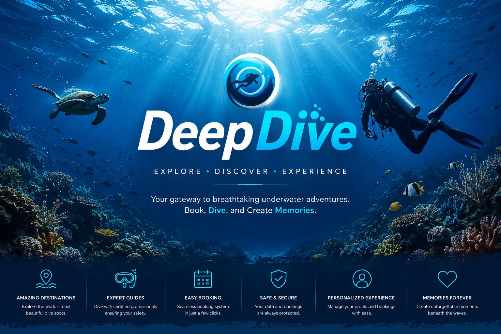

<p align="center">
  
</p>

<h1 align="center">🌊 DeepDive</h1>

<p align="center">
A modern <b>Full-Stack Scuba Diving Booking Platform</b> featuring secure authentication, real-time dive reservations, personalized user profiles, and an immersive ocean-inspired experience.
</p>

<p align="center">


</p>

---

# 🚀 Live Website

### 🌐 https://deepdive-co.netlify.app/

---

# 📖 About

DeepDive is a modern full-stack scuba diving booking platform designed to simplify the process of discovering and reserving unforgettable underwater adventures.

The platform enables users to explore diving destinations, create secure accounts, book scuba diving experiences, manage their profiles, and receive a seamless booking experience through an intuitive ocean-inspired interface. An integrated admin panel allows efficient management of bookings and customer information.

---

# ✨ Features

- 🌊 Interactive Scuba Diving Booking Platform
- 🔐 Secure User Authentication
- 📅 Real-Time Dive Reservation System
- 👤 Personalized User Profiles
- 🏝️ Explore Multiple Diving Destinations
- 📋 Booking History & Management
- 🛠️ Admin Dashboard
- 📱 Fully Responsive Design
- ⚡ Smooth Animations & Interactive UI
- 🎨 Modern Ocean-Inspired User Experience

---

# 🛠 Tech Stack

| Technology | Usage |
|------------|------|
| HTML5 | Website Structure |
| CSS3 | Styling & Responsive Design |
| JavaScript | Frontend Logic |
| Supabase | Authentication & Database |
| SQL | Database Schema |
| Netlify | Deployment |

---

# 📂 Project Structure

```text
DeepDive/
│
├── assets/
│
├── videos/
│
├── index.html
├── island_details.html
├── login_signup.html
├── profile.html
├── offers.html
├── admin.html
│
├── supabase_config.js
├── admin_schema.sql
├── reviews_schema.sql
├── supabase_schema.sql
│
├── .gitignore
├── env.example.js
└── README.md
```

---

# 🎯 Key Highlights

✅ Full-Stack Scuba Diving Booking Platform

✅ Secure Authentication using Supabase

✅ Real-Time Booking Management

✅ Interactive Destination Discovery

✅ Personalized User Profiles

✅ Admin Dashboard for Booking Management

✅ Fully Responsive Design

✅ Smooth Ocean-Themed Animations

✅ Modern UI/UX Experience

---

# 🔐 Authentication & Database

DeepDive utilizes **Supabase** for secure authentication and cloud database management.

- User Sign Up & Login
- Secure Session Management
- Profile Management
- Booking Storage
- Admin Data Management
- SQL Database Schema

---

# 🌊 Future Enhancements

- ⭐ Dive Package Reviews & Ratings
- 💳 Online Payment Integration
- 📍 Interactive Dive Location Maps
- 📧 Booking Confirmation Emails
- 🤿 Equipment Rental Management
- 🌐 Multi-language Support

---

# 👨‍💻 Developed By

## Mathu Bharathi A

Biomedical Engineer • Full Stack Developer • UI/UX Designer

---

# 📄 License

This project is developed for educational and portfolio purposes.

© 2026 DeepDive. All Rights Reserved.
